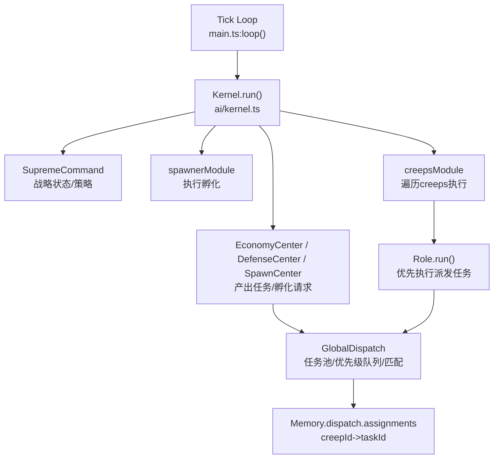
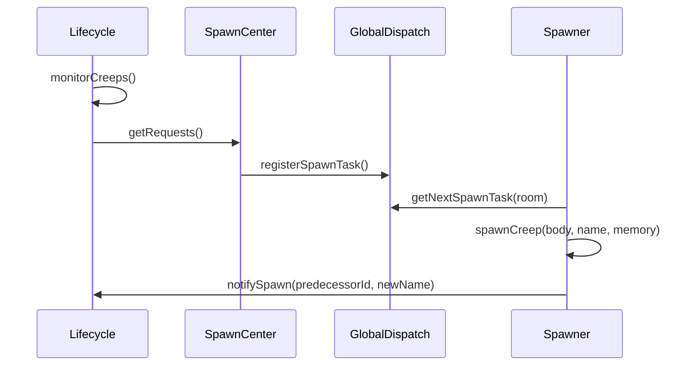

# 项目分析报告（Screeps AI：Project Overlord）

> 适用范围：用于技术评审 / 交接。  
> 代码基线：当前工作区（TypeScript 源码 + Rollup 构建产物 main.js）。  

## 0. 执行摘要

- **架构形态**：典型的 Screeps Tick 驱动系统，采用 “Command（战略）→ Centers（战术）→ Dispatch（调度）→ Role/Modules（执行）” 的分层结构，核心入口在 [main.ts](file:///Users/songhao/Library/Application%20Support/Screeps/scripts/screeps.com/default/src/main.ts)。
- **核心机制**：以任务派发为主（[GlobalDispatch.ts](file:///Users/songhao/Library/Application%20Support/Screeps/scripts/screeps.com/default/src/ai/GlobalDispatch.ts)），传统 role/状态机逻辑作为兜底（[role.ts](file:///Users/songhao/Library/Application%20Support/Screeps/scripts/screeps.com/default/src/ai/role.ts#L40-L45)）。
- **规模指标（静态统计）**：
  - src 目录 TypeScript：48 文件、8196 行（约 5841 行“非空+非注释”代码）
  - tests 目录 TypeScript：1 文件、95 行
  - 复杂度热点（启发式“分支计数”Top）：structurePlanner / GlobalDispatch / populationManager 等
  - 重复代码率（启发式“重复行”估计）：约 **22.6%**（详见附录的统计口径说明）
- **测试现状**：Jest 已接入且可运行，当前仅有 1 个测试套件（4 用例），覆盖率报告显示整体语句覆盖约 **34%**（覆盖集中在 GlobalDispatch 与 types/dispatch）。

---

## 1. 项目整体架构概述

### 1.1 Tick 驱动主循环

主循环由 Screeps 运行时调用 `exports.loop`（构建产物 [main.js:L6581-L6604](file:///Users/songhao/Library/Application%20Support/Screeps/scripts/screeps.com/default/main.js#L6581-L6604)），源码入口为 `export const loop`：

```ts
export const loop = () => {
  if (Game.flags['cleanup']) {
      taskCleanup.run();
      Game.flags['cleanup'].remove();
  }
  Kernel.run();
  if (Game.time % 100 === 0) {
      Object.values(Game.rooms).forEach(room => {
          if (room.controller && room.controller.my) {
              const planner = require("./modules/planner/structurePlanner");
              planner.run(room);
          }
      });
  }
};
```

来源：[main.ts:L71-L94](file:///Users/songhao/Library/Application%20Support/Screeps/scripts/screeps.com/default/src/main.ts#L71-L94)

### 1.2 Kernel（模块生命周期/隔离/统计）

Kernel 作为 “OS 层”，负责模块注册、逐房间执行、全局模块执行，并对每个模块进行 try/catch 与 CPU 记账：

```ts
for (const name in Game.rooms) {
  const room = Game.rooms[name];
  if (!room.controller || !room.controller.my) continue;
  this.modules.forEach(({ name, module, type }) => {
    if (type === "global") return;
    const startCpu = Game.cpu.getUsed();
    try { if (module.run) module.run(room); } catch (e: any) { ... }
    this.recordStats(name, Game.cpu.getUsed() - startCpu);
  });
}
```

来源：[kernel.ts:L45-L65](file:///Users/songhao/Library/Application%20Support/Screeps/scripts/screeps.com/default/src/ai/kernel.ts#L45-L65)

> 说明：Kernel 已具备模块 CPU 统计结构（`profiler`），但当前未看到将 report 持久化到 `Memory.stats` 或可视化面板的集成点（属于可优化项）。

### 1.3 Command / Centers / Dispatch / Execution 四层协作

推荐理解为四层管道：



关键实现入口：
- 模块注册：[main.ts:L29-L67](file:///Users/songhao/Library/Application%20Support/Screeps/scripts/screeps.com/default/src/main.ts#L29-L67)
- 任务数据结构：[dispatch.ts](file:///Users/songhao/Library/Application%20Support/Screeps/scripts/screeps.com/default/src/types/dispatch.ts)
- 任务派发：[GlobalDispatch.dispatch](file:///Users/songhao/Library/Application%20Support/Screeps/scripts/screeps.com/default/src/ai/GlobalDispatch.ts#L351-L428)
- Creep 执行入口：[creepManager.ts:L33-L49](file:///Users/songhao/Library/Application%20Support/Screeps/scripts/screeps.com/default/src/components/creepManager.ts#L33-L49)

---

## 2. 主要功能模块划分与职责说明

### 2.1 目录级模块划分（src/*）

- **ai/**：内核与任务系统核心（Kernel / Dispatch / Role 基类 / 决策）
  - [kernel.ts](file:///Users/songhao/Library/Application%20Support/Screeps/scripts/screeps.com/default/src/ai/kernel.ts)
  - [GlobalDispatch.ts](file:///Users/songhao/Library/Application%20Support/Screeps/scripts/screeps.com/default/src/ai/GlobalDispatch.ts)
  - [role.ts](file:///Users/songhao/Library/Application%20Support/Screeps/scripts/screeps.com/default/src/ai/role.ts)
- **centers/**：战术中心（产出任务、孵化规划、数据中心）
  - [EconomyCenter.ts](file:///Users/songhao/Library/Application%20Support/Screeps/scripts/screeps.com/default/src/centers/EconomyCenter.ts)
  - [DefenseCenter.ts](file:///Users/songhao/Library/Application%20Support/Screeps/scripts/screeps.com/default/src/centers/DefenseCenter.ts)
  - [SpawnCenter.ts](file:///Users/songhao/Library/Application%20Support/Screeps/scripts/screeps.com/default/src/centers/SpawnCenter.ts)
- **components/**：基础设施（缓存、人口、孵化执行器、生命周期、监控）
  - 缓存：[memoryManager.ts](file:///Users/songhao/Library/Application%20Support/Screeps/scripts/screeps.com/default/src/components/memoryManager.ts)
  - 生命周期：[roomManager.ts](file:///Users/songhao/Library/Application%20Support/Screeps/scripts/screeps.com/default/src/components/roomManager.ts)
  - 人口与 body 生成：[populationManager.ts](file:///Users/songhao/Library/Application%20Support/Screeps/scripts/screeps.com/default/src/components/populationManager.ts)
  - 能源危机系统：[EnergyManager.ts](file:///Users/songhao/Library/Application%20Support/Screeps/scripts/screeps.com/default/src/components/EnergyManager.ts)
  - 统计采样：[statsManager.ts](file:///Users/songhao/Library/Application%20Support/Screeps/scripts/screeps.com/default/src/components/statsManager.ts)
- **modules/**：具体执行逻辑（建造、搬运、防御、远矿等）
  - 建造规划（复杂度热点）：[structurePlanner.ts](file:///Users/songhao/Library/Application%20Support/Screeps/scripts/screeps.com/default/src/modules/builder/structurePlanner.ts)
- **roles/**：偏“长程/特化角色”（scout / remote*）
- **types/**：类型与 Memory 结构定义
- **utils/**：通用工具（movement、logger、helpers）

### 2.2 模块接口约定

Kernel 默认期望模块具备 `run(room)`（房间级）或 `run()`（全局级）：

- 注册接口：[Kernel.register](file:///Users/songhao/Library/Application%20Support/Screeps/scripts/screeps.com/default/src/ai/kernel.ts#L23-L25)
- 执行接口（房间级）：[kernel.ts:L51-L58](file:///Users/songhao/Library/Application%20Support/Screeps/scripts/screeps.com/default/src/ai/kernel.ts#L51-L58)
- 执行接口（全局级）：[kernel.ts:L68-L75](file:///Users/songhao/Library/Application%20Support/Screeps/scripts/screeps.com/default/src/ai/kernel.ts#L68-L75)

> 风险提示：当前 `dispatch` 被注册为 `global`，[main.ts:L39](file:///Users/songhao/Library/Application%20Support/Screeps/scripts/screeps.com/default/src/main.ts#L39) 但 `GlobalDispatch.run(room: Room)` 需要 room 参数（[GlobalDispatch.ts:L71-L83](file:///Users/songhao/Library/Application%20Support/Screeps/scripts/screeps.com/default/src/ai/GlobalDispatch.ts#L71-L83)）。这会导致 Kernel 调用 `module.run()` 时传参缺失（潜在运行时异常与任务分配失效风险）。

---

## 3. 核心业务逻辑梳理（流程/示例）

### 3.1 任务生成（Economy / Defense）

以 EconomyCenter 为例（每 10 tick 生成任务）：

```ts
static run(room: Room) {
  if (Game.time % 10 !== 0) return;
  this.generateHarvestTasks(room);
  this.generateTransportTasks(room);
  this.generateActiveDeliveryTasks(room);
  this.generateBuildTasks(room);
  this.generateUpgradeTasks(room);
}
```

来源：[EconomyCenter.ts:L8-L16](file:///Users/songhao/Library/Application%20Support/Screeps/scripts/screeps.com/default/src/centers/EconomyCenter.ts#L8-L16)

任务注册通过 `GlobalDispatch.registerTask` 写入 `Memory.dispatch.tasks` 并入队列：

```ts
task.status = TaskStatus.PENDING;
task.creationTime = Game.time;
Memory.dispatch.tasks[task.id] = task;
Memory.dispatch.queues[task.priority].push(task.id);
```

来源：[GlobalDispatch.registerTask](file:///Users/songhao/Library/Application%20Support/Screeps/scripts/screeps.com/default/src/ai/GlobalDispatch.ts#L93-L122)

### 3.2 任务分配（GlobalDispatch）

派发过程：从房间内挑选 idle creeps，然后按优先级队列逐个匹配 “最合适 creep”，写入 assignment：

```ts
const idleCreeps = room.find(FIND_MY_CREEPS, {
  filter: (c) => !Memory.dispatch.assignments[c.id] && !c.spawning,
});
...
const bestCreep = this.findBestCreep(idleCreeps, task);
if (bestCreep) {
  Memory.dispatch.assignments[bestCreep.id] = task.id;
  task.creepsAssigned.push(bestCreep.id);
  task.status = TaskStatus.RUNNING;
}
```

来源：[GlobalDispatch.dispatch](file:///Users/songhao/Library/Application%20Support/Screeps/scripts/screeps.com/default/src/ai/GlobalDispatch.ts#L355-L425)

匹配策略要点：
- role 白名单（validRoles）
- 身体部件/容量约束（requirements）
- TTL 与估计耗时（estimatedDuration）
- 距离（range）与角色匹配加权

来源：[GlobalDispatch.findBestCreep](file:///Users/songhao/Library/Application%20Support/Screeps/scripts/screeps.com/default/src/ai/GlobalDispatch.ts#L431-L463)

### 3.3 任务执行（Role）

Role 优先执行 “派发任务”，否则退回 legacy 状态机：

```ts
const task = GlobalDispatch.getAssignedTask(this.creep);
if (task) {
  this.runTask(task);
  return;
}
this.checkState();
this.executeState();
```

来源：[role.ts:L29-L45](file:///Users/songhao/Library/Application%20Support/Screeps/scripts/screeps.com/default/src/ai/role.ts#L29-L45)

动作执行通过 `switch(task.type)` 分发到 `harvest/transfer/build/repair/upgrade/...`，并在满足条件后 `completeTask` 释放 assignment。

来源：[role.ts:L76-L183](file:///Users/songhao/Library/Application%20Support/Screeps/scripts/screeps.com/default/src/ai/role.ts#L76-L183)

### 3.4 孵化闭环（Lifecycle → SpawnCenter → Spawner）

生命周期系统检测濒死 creep，并提交替换请求（PRE_SPAWNING）：

```ts
if (creep.ticksToLive < threshold) {
  registry[name] = "PRE_SPAWNING";
  requests[name] = {
    role: creep.memory.role,
    baseMemory: JSON.parse(JSON.stringify(creep.memory)),
    priority: this.getPriority(creep.memory.role),
    requestTime: Game.time,
  };
}
```

来源：[roomManager.ts:L70-L103](file:///Users/songhao/Library/Application%20Support/Screeps/scripts/screeps.com/default/src/components/roomManager.ts#L70-L103)

SpawnCenter 将请求转为 `SpawnTask` 并交给 `GlobalDispatch.spawnQueue`：

来源：[SpawnCenter.processLifecycleRequests](file:///Users/songhao/Library/Application%20Support/Screeps/scripts/screeps.com/default/src/centers/SpawnCenter.ts#L68-L123)

Spawner 作为执行器从队列取任务并调用 `spawn.spawnCreep`：

来源：[spawnManager.ts:L27-L66](file:///Users/songhao/Library/Application%20Support/Screeps/scripts/screeps.com/default/src/components/spawnManager.ts#L27-L66)

流程图：



### 3.5 能源危机系统（EnergyManager）

EnergyManager 将 “总能量/容量” 归一化为危机等级，并用于限制 builder/upgrader 预算：

来源：
- 采样与等级判定：[EnergyManager.update](file:///Users/songhao/Library/Application%20Support/Screeps/scripts/screeps.com/default/src/components/EnergyManager.ts#L194-L277)
- 预算获取：[EnergyManager.getBudget](file:///Users/songhao/Library/Application%20Support/Screeps/scripts/screeps.com/default/src/components/EnergyManager.ts#L283-L298)

---

## 4. 关键技术栈与依赖分析

### 4.1 语言与构建

- 语言：TypeScript（[tsconfig.json](file:///Users/songhao/Library/Application%20Support/Screeps/scripts/screeps.com/default/tsconfig.json)）
- 构建：Rollup（[rollup.config.mjs](file:///Users/songhao/Library/Application%20Support/Screeps/scripts/screeps.com/default/rollup.config.mjs)）
  - input：`src/main.ts`
  - output：`main.js`（cjs）
  - external：`lodash`（Screeps 通常提供全局 `_`，但需注意兼容性）

### 4.2 工程化与测试

- Lint：ESLint（[eslint.config.js](file:///Users/songhao/Library/Application%20Support/Screeps/scripts/screeps.com/default/eslint.config.js)）
- 测试：Jest + ts-jest（[jest.config.js](file:///Users/songhao/Library/Application%20Support/Screeps/scripts/screeps.com/default/jest.config.js)）
- scripts：见 [package.json](file:///Users/songhao/Library/Application%20Support/Screeps/scripts/screeps.com/default/package.json#L10-L15)

### 4.3 运行环境要求

- **Screeps 运行时**：加载 `main.js` 并调用 `exports.loop`；拥有全局对象 `Game/Memory/Room/Creep/...`
- **本地构建/测试**：需要 Node.js + npm（当前环境验证：Node v22.21.1、npm 10.9.4；项目 README 标注 Node > 12，但实际依赖栈更偏现代）

---

## 5. 代码质量评估（可读性/可维护性/性能）

### 5.1 规模与复杂度（量化）

**代码规模（src + tests）**

| 范围 | TS 文件数 | 总行数 | 空行 | 注释行 | 估算代码行 |
|---|---:|---:|---:|---:|---:|
| src | 48 | 8196 | 981 | 1374 | 5841 |
| tests | 1 | 95 | 15 | 4 | 76 |

**按子目录拆分（src）**：ai / centers / components / modules 为主体（详见附录 JSON 统计）。

**复杂度热点（启发式“分支计数”Top10）**  
> 口径：对 `.ts` 文件统计 if/for/while/case/catch/&&/|| 等关键字出现次数，仅用于定位热点，非严格圈复杂度。

1. [structurePlanner.ts](file:///Users/songhao/Library/Application%20Support/Screeps/scripts/screeps.com/default/src/modules/builder/structurePlanner.ts)（98）
2. [GlobalDispatch.ts](file:///Users/songhao/Library/Application%20Support/Screeps/scripts/screeps.com/default/src/ai/GlobalDispatch.ts)（87）
3. [populationManager.ts](file:///Users/songhao/Library/Application%20Support/Screeps/scripts/screeps.com/default/src/components/populationManager.ts)（79）
4. [hauler/index.ts](file:///Users/songhao/Library/Application%20Support/Screeps/scripts/screeps.com/default/src/modules/hauler/index.ts)（64）
5. [movement.ts](file:///Users/songhao/Library/Application%20Support/Screeps/scripts/screeps.com/default/src/utils/movement.ts)（57）
（其余略，详见附录 Top10 列表）

**重复代码率（启发式）**
- 估计重复行占比：**22.6%**
- 口径：对 src 中所有 TS 文件，统计“长度≥30 且非 import/注释”的重复行出现次数占比（用于提示可抽象的模式重复，非严格克隆检测）

### 5.2 可读性与一致性

优点：
- 分层清晰：入口/内核/中心/执行分离；多数模块具备自解释命名。
- 关键系统具备类型建模：任务/优先级/内存结构集中于 [dispatch.ts](file:///Users/songhao/Library/Application%20Support/Screeps/scripts/screeps.com/default/src/types/dispatch.ts)。

问题与建议：
- **注释/文档漂移**：docs/ARCHITECTURE、README_OPTIMIZATION 中存在历史路径/文件名（如 core.*、module.*）与现代码不一致（建议补充“当前架构对照表”并定期更新）。
- **TS 严格性较低**：`tsconfig.strict=false`（见 [tsconfig.json:L9](file:///Users/songhao/Library/Application%20Support/Screeps/scripts/screeps.com/default/tsconfig.json#L9)），使得一些接口不匹配（如 GlobalDispatch.run 签名）不易被编译期发现。

### 5.3 性能瓶颈与风险点

已做的优化点：
- Tick/Heap 双层缓存：[memoryManager.ts](file:///Users/songhao/Library/Application%20Support/Screeps/scripts/screeps.com/default/src/components/memoryManager.ts)
- Kernel 模块级 CPU 统计（但未消费）：[kernel.ts](file:///Users/songhao/Library/Application%20Support/Screeps/scripts/screeps.com/default/src/ai/kernel.ts)

潜在热点：
- **高频 `room.find()`**：如建造规划器中大量直接查找（[structurePlanner.ts:L23-L25](file:///Users/songhao/Library/Application%20Support/Screeps/scripts/screeps.com/default/src/modules/builder/structurePlanner.ts#L23-L25)），建议改为 Cache.getTick 或将结果注入 planner。
- **Memory 写放大**：Dispatch 在 Memory 中保存完整任务对象、errors stack、队列数组（见 [dispatch.ts](file:///Users/songhao/Library/Application%20Support/Screeps/scripts/screeps.com/default/src/types/dispatch.ts#L84-L90)），在大规模房间/任务量下可能触发序列化成本上升。
- **日志刷屏风险**：多处 `console.log` 输出 stack；虽然 creepsModule 做了每 tick 限流（[creepManager.ts:L50-L60](file:///Users/songhao/Library/Application%20Support/Screeps/scripts/screeps.com/default/src/components/creepManager.ts#L50-L60)），但 Kernel/Dispatch 仍可能在异常时高频输出。

---

## 6. 安全与异常处理机制审查

### 6.1 异常隔离

- Kernel 对每个模块 try/catch，避免单模块崩溃导致整 tick 中断：[kernel.ts:L55-L61](file:///Users/songhao/Library/Application%20Support/Screeps/scripts/screeps.com/default/src/ai/kernel.ts#L55-L61)
- Role 对每个 creep try/catch，避免单 creep 异常影响全局：[role.ts:L32-L47](file:///Users/songhao/Library/Application%20Support/Screeps/scripts/screeps.com/default/src/ai/role.ts#L32-L47)

### 6.2 防御/告警（“安全”在 Screeps 语境下）

- 自动 SafeMode 触发逻辑（敌对单位接近关键建筑时）：[DefenseCenter.checkSafeMode](file:///Users/songhao/Library/Application%20Support/Screeps/scripts/screeps.com/default/src/centers/DefenseCenter.ts#L26-L54)
- 游戏内通知：`Game.notify(...)`（同上）

### 6.3 风险与建议

- **外部输入面**：主要来自 `Memory` 与 `Game.flags`，属于玩家自控面；未发现网络 I/O、密钥、鉴权等传统 Web 风险点。
- **内存污染/版本迁移**：多处对 Memory 结构做“惰性初始化”（如 [GlobalDispatch.init](file:///Users/songhao/Library/Application%20Support/Screeps/scripts/screeps.com/default/src/ai/GlobalDispatch.ts#L27-L69)），建议统一维护版本号与迁移函数，避免长期演进时出现字段冲突/残留。

---

## 7. 测试覆盖率概况

### 7.1 Jest 配置与测试目录

- Jest 仅匹配 `tests/**/*.test.ts`：[jest.config.js:L4](file:///Users/songhao/Library/Application%20Support/Screeps/scripts/screeps.com/default/jest.config.js#L4)
- 代码库中同时存在 `test/` 目录（多份 *.test.ts 与 runner.js），但 **默认不会被 jest 执行**（这会造成“看起来有很多测试，但 CI/本地命令不跑”的偏差）。

### 7.2 覆盖率（本次运行 npm test -- --coverage）

- All files：Statements **34.09%** / Branch **22.85%** / Functions **37.5%** / Lines **36.4%**
- 覆盖集中在：
  - [GlobalDispatch.ts](file:///Users/songhao/Library/Application%20Support/Screeps/scripts/screeps.com/default/src/ai/GlobalDispatch.ts)
  - [dispatch.ts](file:///Users/songhao/Library/Application%20Support/Screeps/scripts/screeps.com/default/src/types/dispatch.ts)

---

## 8. 部署与运行环境要求

### 8.1 构建与产物

- 构建命令：`npm run build`（Rollup 生成 `main.js`）
- Screeps 侧入口：`main.js` 导出 `loop`

### 8.2 部署方式

- IDE 同步到 Screeps（当前目录即 `/Screeps/scripts/screeps.com/default`）
- 或复制构建产物 `main.js` 到 Screeps 脚本区

---

## 9. 潜在优化建议（按优先级）

### 9.1 高优先级（稳定性/正确性）

1. **修复 dispatch 模块调用签名不匹配**
   - 现状：Kernel 全局模块调用 `run()`，而 GlobalDispatch 需要 `run(room)`（见 2.2 风险提示）
   - 建议：将 dispatch 注册为房间级，或提供 `run()` 包装遍历房间调用 `dispatch(room)`。
2. **修复 ESLint 阻断项（require-imports）**
   - 现状：main.ts 中 `require("./modules/planner/structurePlanner")` 触发 lint error（[main.ts:L89](file:///Users/songhao/Library/Application%20Support/Screeps/scripts/screeps.com/default/src/main.ts#L89)）
   - 建议：改为静态 import 或 `await import()`（并配合构建工具处理）。

### 9.2 中优先级（可维护性/演进）

1. **开启 TS 严格模式分阶段迁移**
   - 先从 `noImplicitAny`、`strictNullChecks` 小步推进，优先覆盖 ai/centers/components 接口层。
2. **统一测试目录与执行口径**
   - 将 `test/` 与 `tests/` 合并，或调整 jest.config 以纳入现有测试资产。
3. **文档对齐**
   - 为 docs/ARCHITECTURE、README_OPTIMIZATION 增加“当前代码路径映射”，避免交接误导。

### 9.3 性能优先级（CPU/Memory）

1. **将高频查询统一接入 Cache**
   - 尤其是 planner、monitor、remote 模块中高频 `room.find`。
2. **为 Dispatch 引入轻量任务表示**
   - 大任务对象可拆分为 “索引字段（Memory）+ 运行期扩展（Tick/Heap）”，降低序列化成本。
3. **将 Kernel profiler 集成到 StatsManager**
   - 形成可量化的“模块 CPU 平均/峰值”曲线，便于定位瓶颈。

---

## 附录 A：静态度量与口径说明

### A.1 LOC 统计口径

- 统计范围：`src/` 与 `tests/` 的 `.ts/.d.ts` 文件
- 估算代码行：`总行数 - 空行 - 以 // 或 /* 或 * 开头的行`

### A.2 复杂度热点口径

- 对 TS 文件统计 if/for/while/case/catch/&&/|| 等 token 次数（用于热点定位，不代表真实圈复杂度）。

### A.3 重复代码率口径

- 对 TS 文件提取“trim 后长度≥30 且非 import/注释”的行，统计出现次数>1 的行占比。

